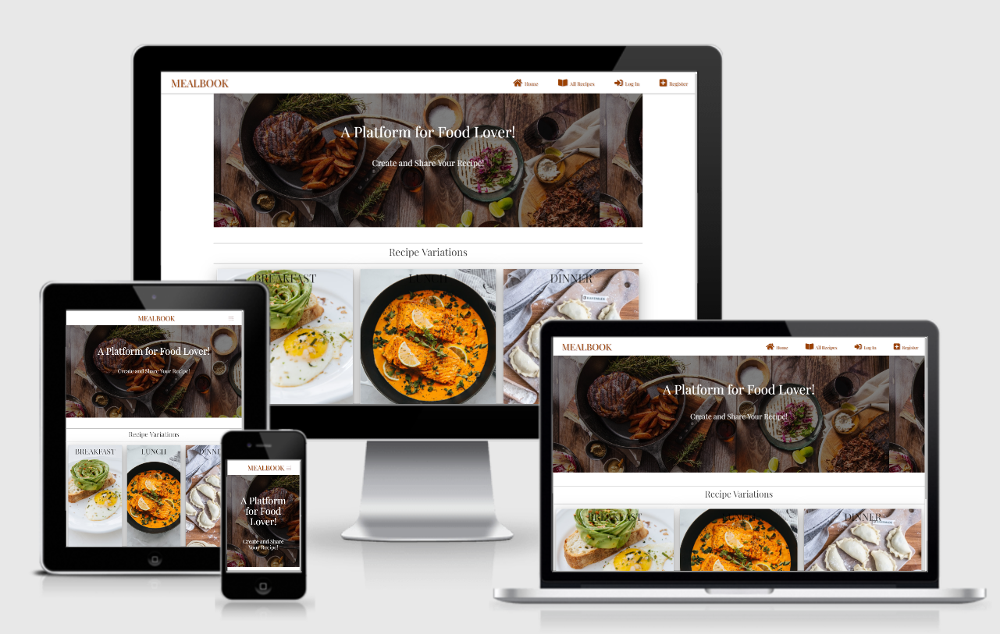

# MEALBOOK
MEALBOOK is a practical Python and Data Centric Development Milestone Project.

This is a Full-Stack MongoDB-based Flask project. The main objective is to create a recipe database which allows users to perform the CRUD functionality (create, read, update, and delete). MEALBOOK offers features of all recipes accessibility to either registered or non registered user. They can browse recipes created by other creators and themselves. Registered users can create, edit, and delete their own recipes. MEALBOOK is aiming to create a food lover community where all the registered and non-registed inspire and get inspired by others.

The website consists of:
* Home Page: Landing image with different varieties of foods as background, different meal types showing different meal varieties created on this website.
* All Recipes Page: Display all recipes that have been created by different users. All the recipes are display as a card structure which showing image(if user uploads their food's image), , meal type, recipe's name, and number of serving. Each page consists of a maximum of eight card recipes, and user can click on the second page to browse more recipes. Search recipe bar is shown on top of the page. The number of recipe created is shown on top of the page highlighted with a red underline. 
* Log In Page: User can log in to their own account.
* Register Page: Non registered user can create an account.
* Profile Page: Display all the recipes created by the user him/herself. The number of recipe created is shown on top of the page highlighted with a red underline. 
* Recipe Detail Page: This page is directed when user/non user click on the recipe card. It displays recipe name, recipe image, meal type, diet type, serving size, prep time, cooking time, author, dish description, ingredients, and methods of cooking.
* New Recipe Page: All the essentials input for the user to add in the content related to the recipes attributes. Edit and Delete buttons are shown for further changes.

Non-user page accessibility:
* Home Page
* All Recipes Page
* Log In Page
* Register Page
* Recipe Detail Page 

User page accessibility:
* Home Page
* All Recipes Page
* Log In Page
* Register Page
* Recipe Detail Page 
* Profile Page 
* Add Recipe Page
* Edit Recipe Page

## **User Experience (UX)**

### **Player goals**

* Create a simplistic and visual tempting yet flawless recipe app.
* The purpose of the app is obvious when the user click landed on the main page. 
* Eye-catching landing image and description that suit the theme of the website.
* All recipes created are shown in a page and can be navigated by just one click. The page will show an overview of recipes created.
* The details of the recipe can be viewed by clicking on the recipe card profile. 
* Each specific recipe profile consists of all neccessary data created by the author.
* Registered user can edit or delete their own recipe but not others. 
* Non registered user do not have edit and delete button when browsing the recipe profile. 
* Registered user can add recipes through add recipe link by just one click on the top navigation bar. 
* All navigation links and input in add recipe page have relevant icons right beside it so all users can know what does the link/input do in a glance. 
* All required inputs are marked with an asterisk symbol in red color. 
* Easy navigation between different pages without any broken link or page error.
* Well-structured content created from programming that provides a user-friendly MEABOOK app.
* Utilizing HTML, CSS, Javascript, Python, Flask, Jinga Template, and MongoDB to showcase the coding skill and as the third portfolio.  

### **User Stories**

* View all the recipes without having to register an account.
* View all the recipe details as in recipe image, recipe meal type, recipe name, recipe diet type, recipe serving size, recipe preparation time, recipe cooking time, dish description, ingredients needed, and cooking methods. All of these are shown in an organized layout. All the details have a relevant icon so user can easily know what it is.
* Able to search the keyword by typing keyword into the search bar. 
* A respond message will show if there is no result returned. 
* Register a new account.
* Add a new recipe.
* Edit or delete an existing recipe. 
* View the total recipes created.
* Log out with one click and terminate session.
* Use the website from any device such as desktop, laptop, tablet and mobile.    

### **Design Choices**

* Framework
    * [Materialize](https://materializecss.com/), a front-end framework was utilized for this project. Navbars, recipe cards, forms, and grid was created. 
    * [JQuery](https://jquery.com/) was used to initialize some Materialize elements. 
* Imagery
    * The background image on the home page is using the image with combination of different dishes. This is to demonstrate the main purpose of the website, which act as a representative element of the website is focusing on. This is to attract the user's attention and yield a trust emotion toward the website. The background images on the log in page and register page are food relevant as well to match the website's theme. 
* Color Scheme
    * The main color of the website (except the images) used are generally in white tone. This is because all the images used and will be uploaded by the user to the website are generally rich in colors due to the food content. Hence, the colours of the images themselves are sufficient to yield colours that are able to enrich the website. Furthermore, white color tone does match to the design purpose which is clean and simplicity.
    * The colors of the website title and other navigation links are set to maroon color to yield contrast with the white background of the website. 
    * Dark grey color is used for the top page of navigation links when the user hovers over the links to present a great contrast to the white tone background and shows to the user that they are currently hovering at that link. 
    * Links are shown in blue color. 
    * Add recipe button and Delete button is shown in red to alert the user. 
    * Edit button is shown in green color.
* Typography
    * Playfair Display font is the main font used throughout the website pages with Sans Serif as the fallback font. 
    * Playfair Display font looks elegant either as a title or the content on a website. It tends to yield a trustable emotion to the user as well which is a vital element for a website. 
* Styling
    * Each of the links/pages has the same navigation menu so the user can direct to the other navigation sites when they are browsing particular links.
    * Recipe cards profile has a rounded border style to look more modern. 
* Icons 
    * [FontAwesome](https://fontawesome.com/) and [MaterializeIcon](https://materializecss.com/icons.html) are the main icons library used for this project. Icons are a great in grabbing user's attention. It is user-friendly and absolutely useful for non-native english speakers and the icons stand out their purpose.  

### **Wireframes**

Balsamiq software was used to generate the following wireframes while doing the project planning and scope plan section. Click on the following links to view.

* [Home](wireframes/home.pdf)
* [All Recipe](wireframes/all_recipes.pdf)
* [Log In](wireframes/login.pdf)
* [Register](wireframes/register.pdf)
* [Add/EditRecipe](wireframes/add.edit_recipe.pdf)
* [Recipe Details](wireframes/recipe_details.pdf)

# **Features**

### **Home Navigation Bar**

The logo of the website is located at the top left position, whereas the remaining navigation links (Home, All Recipes, Log In, Register) for non-registered user, (Home, All Recipes, Log In, Register, Profile, Add Recipe) for registered user are situated at top right corner. Both MEALBOOK and Home navigation links are redirected to the home page. In a tablet and mobile resolution, the navbar is collapsed into a burger bar icon and a sidenav bar will pop out once clicked.  

### **Home Navigation Bar for non-registered user**

* Home
* All Recipes
* Log In
* Register

### **Home Navigation Bar for registered user**

* Home
* All Recipes
* Profile
* Add Recipe
* Log Out

